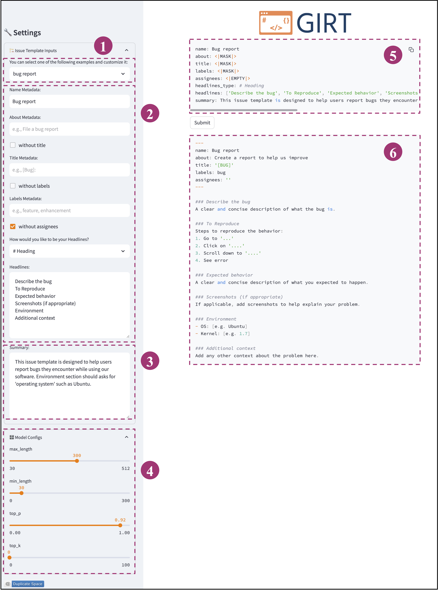

<p align="center">

</p>
<p align="center">
<a href="https://huggingface.co/anonmsr/girt-t5-base"></a>
<a href="https://huggingface.co/spaces/anonmsr/girt-space"></a>
<a href="https://huggingface.co/datasets/anonmsr/girt-instruct"></a>
</p>

## TL;DR

The repository introduces **GIRT-Model**, an open-source assistant language model that automatically generates IRTs. It creates IRTs based on the developer’s
instructions regarding the structure and necessary fields.

## Links

- **Model:** https://huggingface.co/anonmsr/girt-t5-base
- **Dataset:** https://huggingface.co/datasets/anonmsr/girt-instruct
- **Space:** https://huggingface.co/spaces/anonmsr/girt-space


## How to load model (local)
```python

from transformers import AutoTokenizer, AutoModelForSeq2SeqLM

# load model and tokenizer
model = AutoModelForSeq2SeqLM.from_pretrained('anonmsr/girt-t5-base')
tokenizer = AutoTokenizer.from_pretrained('anonmsr/girt-t5-base')

# Ensure that the model is on the GPU for cpu use 'cpu' instead of 'cuda'
model = model.to('cuda')


# method for computing issue report template generation
def compute(sample, top_p, top_k, do_sample, max_length, min_length):

    inputs = tokenizer(sample, return_tensors="pt").to('cuda')

    outputs = model.generate(
        **inputs,
        min_length= min_length,
        max_length=max_length,
        do_sample=do_sample,
        top_p=top_p,
        top_k=top_k)

    generated_texts = tokenizer.batch_decode(outputs, skip_special_tokens=False)
    generated_text = generated_texts[0]
    
    replace_dict = {
        '\n ': '\n',
        '</s>': '',
        '<pad> ': '',
        '<pad>': '',
        '<unk>!--': '<!--',
        '<unk>': '',
    }
    
    postprocess_text = generated_text
    for key, value in replace_dict.items():
        postprocess_text = postprocess_text.replace(key, value)

    return postprocess_text

prompt = "YOUR INPUT INSTRUCTION"
result = compute(prompt, top_p = 0.92, top_k=0, do_sample=True, max_length=300, min_length=30)
```

## Dataset

A dataset in the format of pairs of instructions and corresponding outputs. GIRT-Instruct is constructed based on [GIRT-Data](https://arxiv.org/abs/2303.09236), a dataset of IRTs. 
We use both GIRT-Data metadata and the [Zephyr-7B-Beta](https://huggingface.co/HuggingFaceH4/zephyr-7b-beta) language model to generate the instructions. This dataset is used to train the GIRT-Model.

We have 4 different types in GIRT-Instruct. These types include:

- **default:** This type includes instructions with the GIRT-Data metadata.
- **default+mask:** This type includes instructions with the GIRT-Data metadata, wherein two fields of information in each instruction are randomly masked.
- **default+summary:**  This type includes instructions with the GIRT-Data metadata and the field of summary.
- **default+summary+mask:** This type includes instructions with the GIRT-Data metadata and the field of summary. Also, two fields of information in each instruction are randomly masked.

### How to load dataset 

```python
from datasets import load_dataset
dataset = load_dataset('anonmsr/girt-instruct', split='train')
print(dataset['train'][0]) # First row of train
```

## Code
The code for fine-tuning the GIRT-Model and evaluation in a zero-shot setting is available [here](./train-evaluate-girt.ipynb). It downloads the GIRT-Instruct and fine-tunes the t5-base model.

We also provide the [code](summary_gen.ipynb) and prompts used for the Zephyr model to generate summaries of instructions.

## UI (online)

This UI is designed to interact with GIRT-Model, it is also accessible in huggingface: https://huggingface.co/spaces/anonmsr/girt-space
1. IRT input examples
2. metadata fields of IRT inputs
3. summary field of IRT inputs
4. model config
5. generated instruction based on the IRT inputs
6. generated IRT

<p align="center">

</p>


